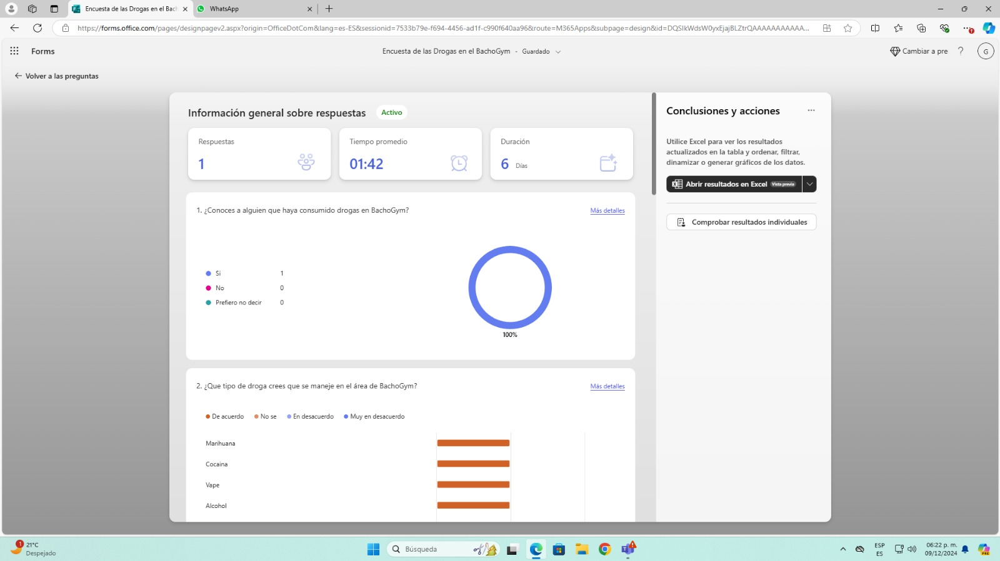

# ProyectoTics
Se planteo un problema, sobre las adicciones en bachogym del bachchilleres plantel num. 4 ya que muchas veces se murmuraba que ahi era en punto de venta de drogas de esta institucion; al igual se creo unas encuesta basada en los alumnos y maestros de este plantel. Hubo una encuesta muy interesante de un una persona llamada leonardo que al entrar a este plantel y tener problemas familiares recayo en una situacion que muchos alumnos han pasado.
Leonardo tuvo una crisis la cual pudo recuperarse gracias al institucion y docentes que lo apoyaron significativamente, el paso por muchas trajedias el estuvo al borde de la muerte. Sus situaciones particularmente llamaron la atencion de mucha gente que al comprender su situacion lo apoyaron vitalmente. 
## EL ES LEONARDO:

Conversamos con el y nos conto un poco mas de sus situaciones actuales, con su consentimiento pudimos hacer un journey maps (mapa de situaciones), que planteamos aqui para que el publico en general pueda ponerse en esa situacion de vulneravilidad

Gracias a el pudimos formular encuestas con la opinion de los alumnos y maestros de este plantel que dieron su opinion de esta intitucion y sus problemas en bachogym 
https://forms.office.com/r/LLJDxcLzLj?origin=lprLink
y estos fueron los resultados.

Y pudimos crear un app que puedes consultar los apoyos, numeros, intituciones
